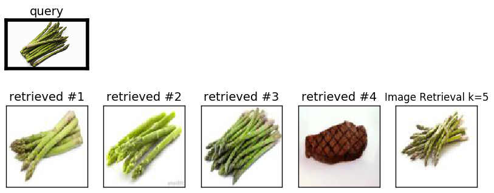
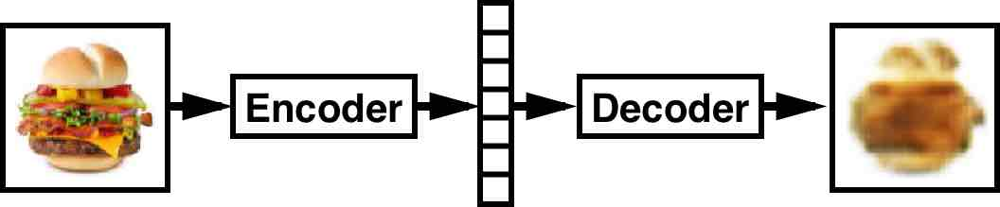

# artificio: A suite of computer vision deep learning algorithms

We provide here a suite of deep learning computer vision algorithms that are ready for real-world use:

### [Image Retrieval (via Transfer Learning)](image_retrieval)

 

### [Image Retrieval (via Autoencoders)](image_retrieval)

 

### [Image Processing Tools](process_image)

 

### [Google Images Scraper](scrape_google_images)

 

#### Authors

Anson Wong
