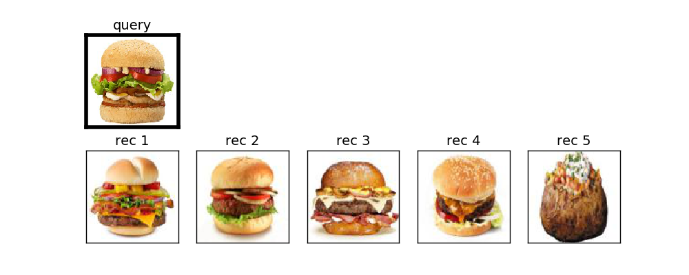
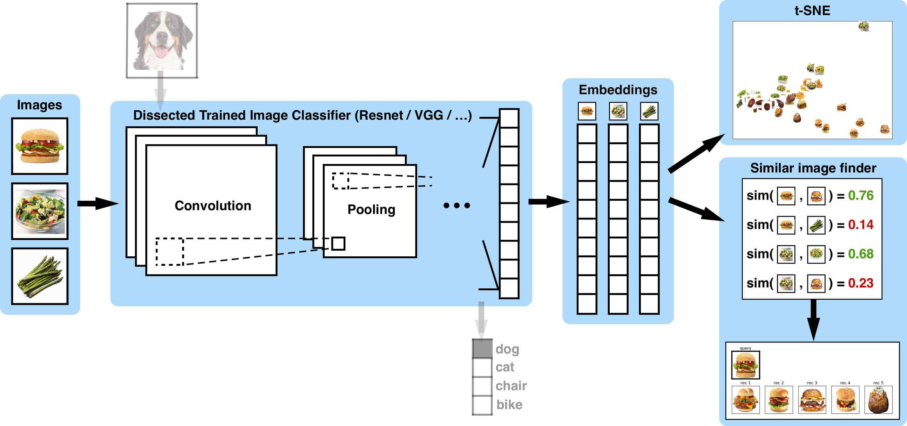

# artificio: A suite of computer vision deep learning algorithms

We provide here a suite of deep learning computer vision algorithms that are ready for real-world use:

### [Similar Image Finder (using Transfer Learning)](https://github.com/ankonzoid/artificio/tree/master/similar_images_TL)

 

### [Similar Image Finder (using Autoencoders)](https://github.com/ankonzoid/artificio/tree/master/similar_images_AE)

 

### [Image Processing Tools](https://github.com/ankonzoid/artificio/tree/master/process_images)

 

### [Google Images Scraper](scrape_google_images)

 

#### Authors:

Anson Wong
