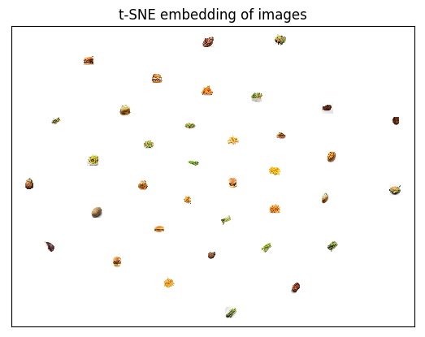

# Image Retrieval (via Autoencoders & Transfer Learning)

Given a set of query images and a set of store inventory images, we find the top-k similar inventory images that are the most 'similar' to the set of query images in an unsupervised way of training an autoencoder, then using its encoder to embed the images and perform kNN in to find 'similar' images. 

<p align="center"> 

</p>

In this code, we train a convolutional autoencoder on 36 steakhouse food images (6 of each of steak, potato, french fries, salads, burger, asparagus), and make similar image food recommendations based on the above algorithm to achieve a result of:

<p align="center"> 

</p>

<p align="center"> 

</p>

The model performs fairly well as a vanilla model with minimal fine-tuned training, in the sense that the top similar recommended images tend to be in same food category as the query image (i.e. querying a burger gives mostly burgers, and querying a salad gives mostly salads, ...). There is still much room for improvement in terms different neural network architectures, more/different training images, hyperparameter tuning to improve the generality of this model. 

The algorithm:

1) Train an autoencoder with training images in the same domain as the inventory images

2) Use the trained encoder to embed both the query images and the inventory images

3) Perform kNN (euclidean/cosine similarity) to find the inventory nearest neighbour image embeddings to the query image embeddings, and keep the k closest embeddings as the top-k recommendations

### Usage:

To make sure our similar images finder (trained on steakhouse food images) works on our test images, run

```
python3 similar_images_AE.py
```    

When the run is complete, your answer images can be found in the `output` directory. However, if you would like to train the model from scratch then:
 
1. In `similar_images_AE.py`, set:
     
    * `model_name` to either `"simpleAE"` (1 FC hidden layer) or `"convAE"` (CNN)

    * `process_and_save_images = True` to perform the proper pre-processing of the images

    * `train_model = True` to instruct the program to train the model from scratch (it also saves it once the training is complete)

2. Run

```
python3 image_retrieval_AE.py
```

### Libraries

* numpy, matplotlib, skimage, sklearn, tensorflow, multiprocessing

### Authors

Anson Wong


# Similar Image Retrieval (using transfer learning)

Given a set of database images, we take the trained image classification VGG network, remove its last layers, and use the dissected model to convert our raw images into feature vectors for similarity comparison to produce similar image recommendations. No training is needed as we are re-using the low-level weight layers in the VGG network. A schematic for our implementation is shown here:

<p align="center"> 

</p>

As an example of its utility, we show that we can find similar food items in a small steakhouse food database by querying a burger and a salad below:

<p align="center"> 

</p>

<p align="center"> 

</p>

In addition to making similar image recommendations, we can also visualize the image feature vectors by mapping the high-dimensional vectors onto a 2-dimensional manifold via the t-SNE algorithm to get a sense of how "far away" images are from each other in the feature space: 

<p align="center"> 

</p>

The steps towards building our similar images finder:

1. Prepare our image database. We prepared by default a 36 images database of common steakhouse foods (6 classes).

2. Take the VGG model and remove its last layers.

3. Convert our image database into feature vectors using our dissected VGG model. If the output layer of the dissected model are convolutional filters then flatten the filters and append them make a single vector.

4. Compute similarities between our image feature vectors using an inner-product such as cosine similarity or euclidean distance

5. For each image, select the top-k images that have the highest similarity scores to build the recommendation


### Usage:

1. Place your database of images into the `db` directory.

2. Run the command:

```
python similar_images_TL.py 
```

All output from running this code will be placed in the `output` directory. There will be a `tsne.png` plot for the t-SNE visualization of your database image embeddings, as well as a `rec` directory containing the top `k = 5` similar image recommendations for each image in your database.

If the program is running properly, you should see something of the form:

```
Loading VGG19 pre-trained model...
Reading images from 'db' directory...

imgs.shape = (39, 224, 224, 3)
X_features.shape = (39, 100352)

[1/39] Plotting similar image recommendations for: steak2_resized
[2/39] Plotting similar image recommendations for: asparagus5_resized
[3/39] Plotting similar image recommendations for: steak4_resized
...
...
...
[38/39] Plotting similar image recommendations for: salad4_resized
[39/39] Plotting similar image recommendations for: burger_test
Plotting tSNE to output/tsne.png...
Computing t-SNE embedding
```

### Required libraries:

* keras, numpy, matplotlib, sklearn, h5py, pillow

### Authors:

Anson Wong