# Image Retrieval (via Autoencoders / Transfer Learning)

Given a set of query images and database images, we perform image retrieval on database images to get the top-k most similar database images using kNN on the image embeddings with cosine similarity as the distance metric. As an example, we provide 36 steakhouse food database images (6 of each food class: steak, potato, french fries, salads, burger, asparagus) and perform similar image retrieval by querying 3 unseen test images.

We provide two unsupervised methods here: 

### 1) **Transfer learning** 

By performing generating image embeddings using a pre-trained network such as VGG19. This is done by removing its last few layers, and performing inference on our images vectors for the generation of flattened embeddings. No training is needed throughout this entire processing, only the loading of the pre-trained weights.

<p align="center"> 

</p>

### 2) **Training Autoencoders** 

We train both a simple autoencoder and a convolutional autoencoder on our database images with the objective of minimizing reconstruction loss. After sufficient training, we extract the encoder part of the autoencoder and use it during inference to generate flattened embeddings.

<p align="center"> 

</p>

<p align="center"> 
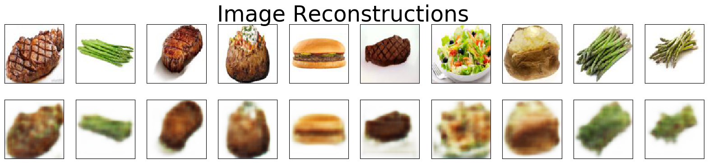
</p>

## Visualizations

### **Transfer Learning**

<p align="center"> 
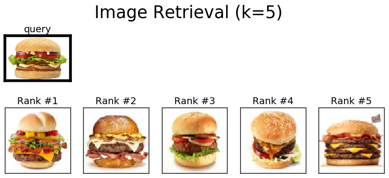
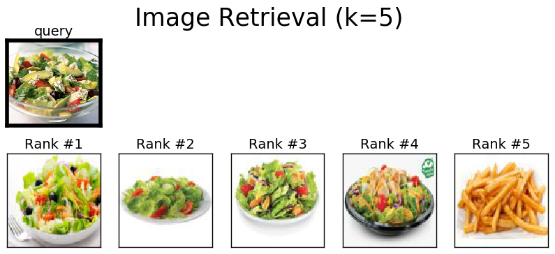
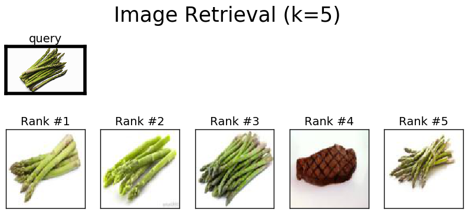
</p>

<p align="center"> 
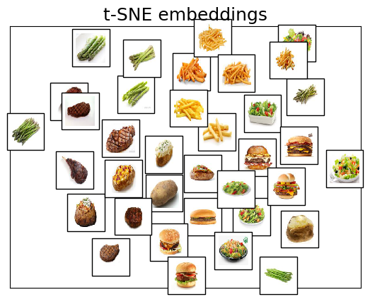
</p> 

### **Convolutional Autoencoder**

<p align="center"> 
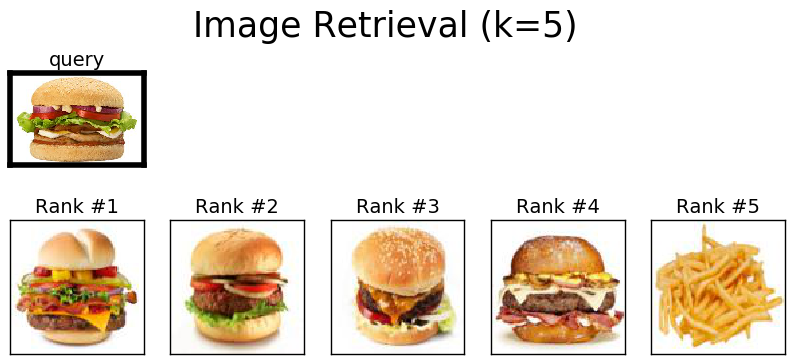
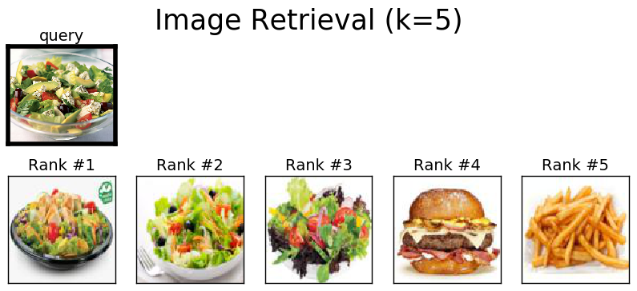
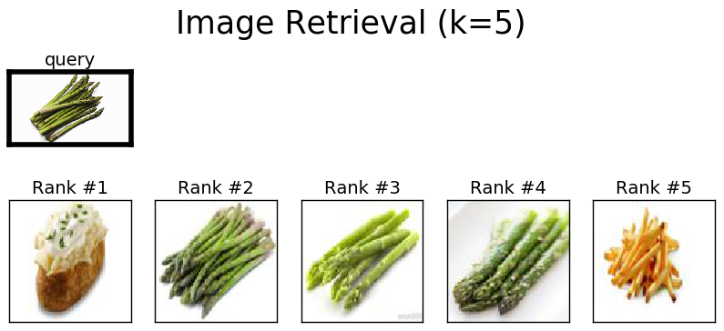
</p>

<p align="center"> 

</p> 

<p align="center"> 

</p>

### **Simple Autoencoder**

<p align="center"> 
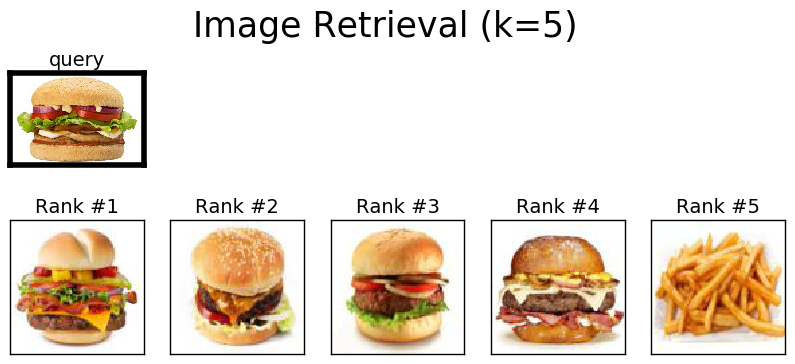
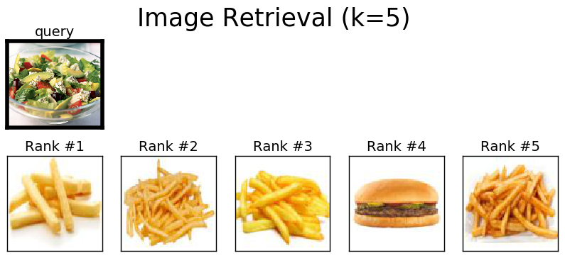
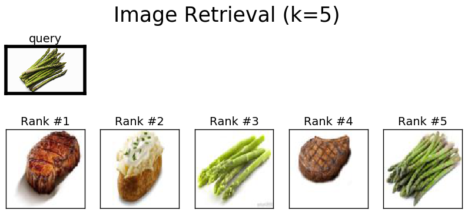
</p>

<p align="center"> 
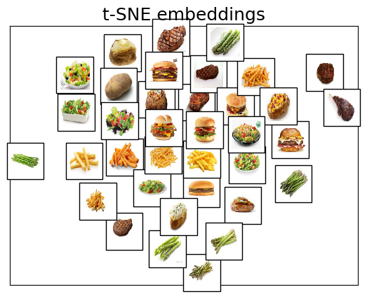
</p> 

<p align="center"> 
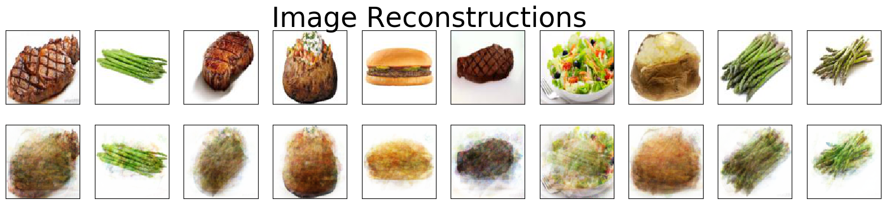
</p>

## Usage

Run

```
python3 image_retrieval.py
```    

after selecting the model you want to use by editing the model name in `image_retrieval.py` 

```
modelName = "convAE"  # try: "simpleAE", "convAE", "vgg19"
trainModel = True
```

There are 3 models to choose from: 
* `"simpleAE"` = simple fully-connected autoencoder
* `"convAE"` = multi-layer convolutional autoencoder 
* `"vgg19"` = pre-trained VGG19 for transfer learning

All output visualizations can be found in the `output` directory.

## Example output

```
Reading train images...
Reading test images...
Image shape = (100, 100, 3)
Loading VGG19 pre-trained model...
input_shape_model = (100, 100, 3)
output_shape_model = (3, 3, 512)
Applying image transformer to training images...
Applying image transformer to test images...
 -> X_train.shape = (36, 100, 100, 3)
 -> X_test.shape = (3, 100, 100, 3)
Inferencing embeddings using pre-trained model...
 -> E_train.shape = (36, 3, 3, 512)
 -> E_test.shape = (3, 3, 3, 512)
 -> E_train_flatten.shape = (36, 4608)
 -> E_test_flatten.shape = (3, 4608)
Fitting k-nearest-neighbour model on training images...
Performing image retrieval on test images...
Visualizing t-SNE on training images...
```

## Libraries

* tensorflow, skimage, sklearn, multiprocessing, numpy, matplotlib

## Authors

Anson Wong

