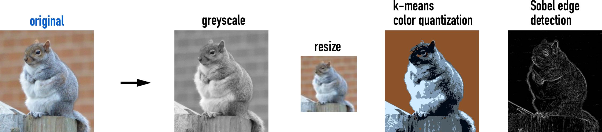
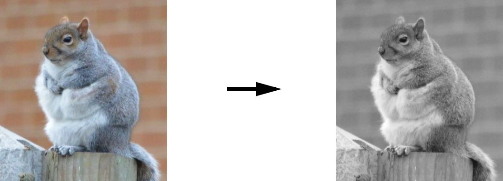
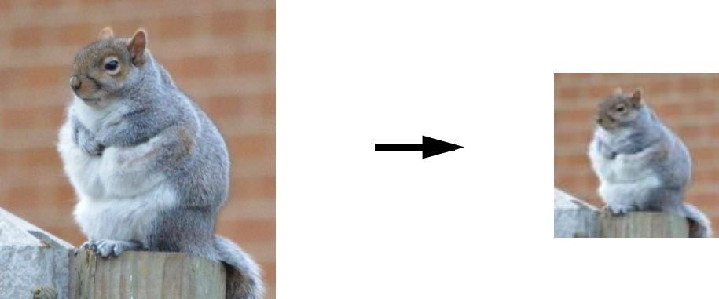
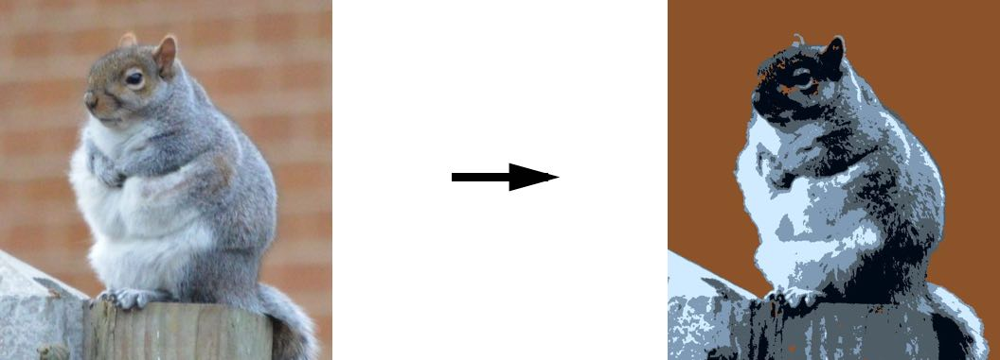
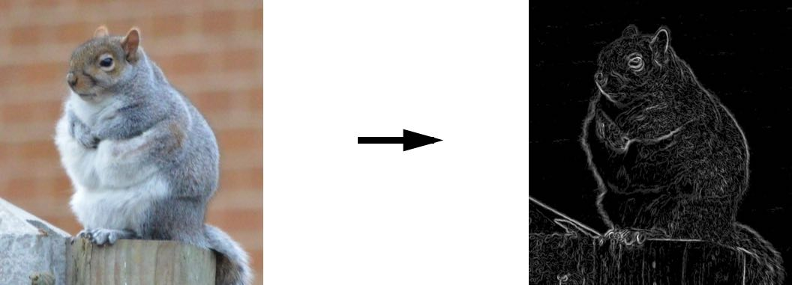

# Image Processing Tools

<p align="center">

</p>

Here we provide tools for you for processing an image. Specify the image file, run the code, then pick up your processed images from the `output` directory.

Currently we provide 4 common image processing techniques:

1) Greyscaling

2) Force resizing

3) K-means color quantization based (cluster center colors or custom colors)

4) Edge detection (Gaussian blur + Sobel)


### Usage

Run

```
python3 process_image.py
```

### Example output

#### 1) Greyscaling



#### 2) Force resizing (image is downsampled here)



#### 3) K-means quantization (cluster centers colors or custom colors)



#### 4) Edge detection (Gaussian blur + Sobel)




### Libraries

* opencv, skimage, numpy, matplotlib

### Authors

Anson Wong