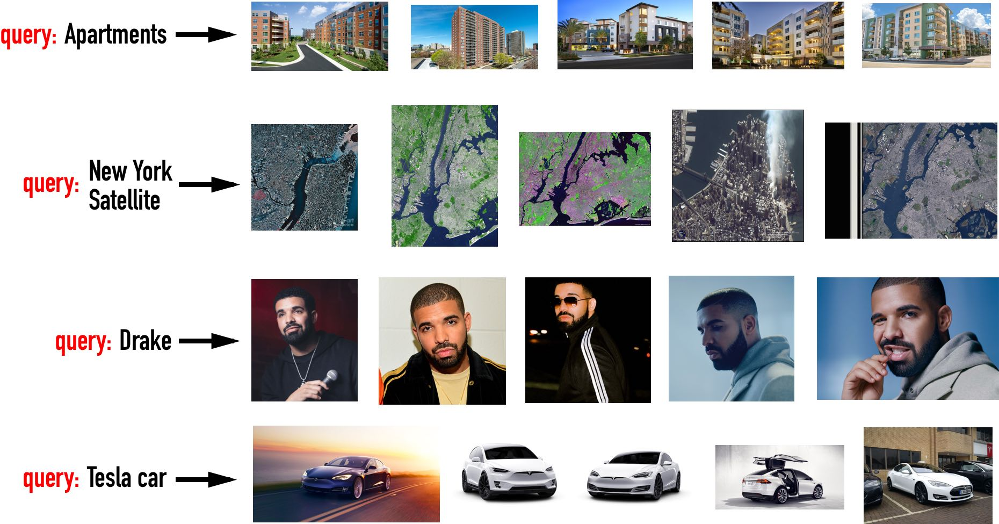

# Google Images Scraper

Google images scraper for downloading the top _k_ images of your choice given query text (written in Python).

<p align="center">

</p>

### Example usage

Run

```
python3 scrape_google_images.py
```

with parameters

```
query = "drake"  # google images query text
k = 5  # top-k images will be scraped
outDir = "output"  # output directory to save images
dt_stall = 2  # number of seconds to stall between image scrapes
```

gives

```
Scraping top k=5 Google images for query: 'drake'
Parsed 100 google image urls!
[1/5] Downloading image to 'output/drake-1.jpg'...
[2/5] Downloading image to 'output/drake-2.jpg'...
[3/5] Downloading image to 'output/drake-3.jpg'...
[4/5] Downloading image to 'output/drake-4.jpg'...
[5/5] Downloading image to 'output/drake-5.jpg'...
```

with the scraped images saved to the `output` directory.

<p align="center">

</p>

### Libraries

* bs4, urllib, requests

### Authors

Anson Wong